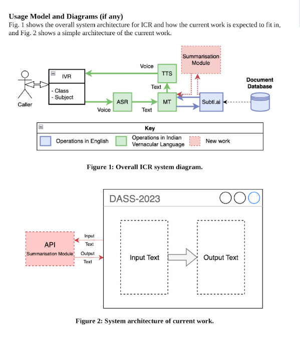

# DASS-2022-23-Team-46 - Summarisation of ICR System Responses

## Description

The intelligent caller response (ICR) is a multi-organization effort, to create a voice based smart response system capable of answering questions in Indian vernacular languages. The existing system architecture consists of an automated speech recognition (ASR) module, machine translation (ML) module, a semantic document search engine, and a text-to-speech (TTS) module. The larger project is currently under data collection and model adaptation phase.

The current effort is to develop a module to summarize the responses from the document search engine, to produce more “human friendly” responses. This will be limited to the use of existing summarisation engines and exploring input content requirements to output quality. The major development is on building the API wrappers to the chosen ML engines and a simple UI for the purposes of demonstration.

## Profile of Users

The UI developed is meant only for demonstrative purposes only, hence has one end-user with a specific use case - the dev team to demo to an audience. As such the user must be capable of using the system by providing input text and receiving output summarised text, through a clean self-explanative UI.

The backend API for the summarization module is however meant to be compatible for future incorporation to the larger ICR system, as such must be very well documented in terms of expected input & output, deployment instructions, and finally the choice and performance of ML model (to allow for future ML model adaptations).

## Feature highlights

The developed system requires the following features:

### Frontend/UI:

1. Enter input text.
2. Perform API calls.
3. Display output text.

### Backend/API:

1. Receive input text.
2. Run ML inference model to generate summarised text.
3. Send back output text.

## Usage Model and Diagrams (if any)

Fig. 1 shows the overall system architecture for ICR and how the current work is expected to fit in, and Fig. 2 shows a simple architecture of the current work.

